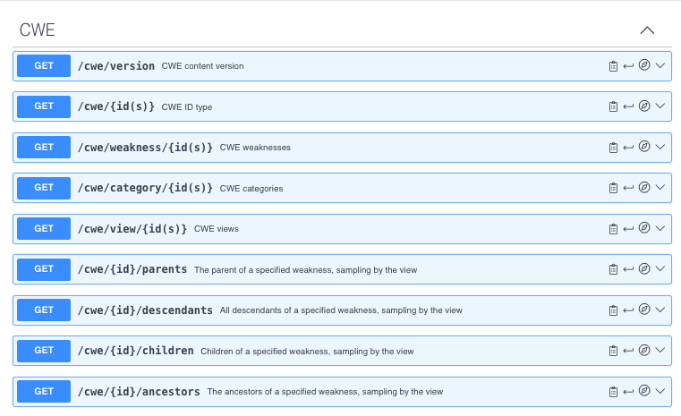

## Quick Start Instructions for CWE REST API Users

The Common Weakness Enumeration (CWE) is a list of SW and HW weaknesses that can lead to vulnerabilities and enable cyber attacks. For a full description of CWE consult https://cwe.mitre.org/about/index.html.

The CWE REST API provides access to CWE content for security SW and HW architects, EDA tool developers, verification engineers who are concerned about mitigating security risks in their products.

As the CWE content changes only several times a year when there is a new release, we suggest using the API to populate a cache of the CWE content locally, which can be refreshed when the new release becomes available.  

The API is available without any need to register or use any credentials.

The root URL to access the API is: https<nolink>://cwe-api.mitre.org/api/v1/.  It must be prepended to these available endpoints:

To view detailed documentation of the endpoints, use the [Swagger editor](https://editor.swagger.io). Download the file [openapi.json](openapi.json) to your local device and then import it into the Swagger editor using **File>Import file**

Note that the  weakness, category, and view endpoints will return the contents of the XML file for that CWE entry expressed in JSON.  This is similar to the content that is available to download from https://cwe.mitre.org/data/downloads.html. To obtain additional information regarding relationships and membership, use the children, parents, descendants or ancestors endpoints.

Note that a request for the children, parents, descendants or ancestors of an existing CWE will return an empty list, "[]", and a status of 200 if none exist.  However, requesting a CWE id that does not exist from one of those endpoints will return a status of 404.

Additionally, using an endpoint for the wrong type of CWE (e.g., using the weakness endpoint for a category) will also return a status of 404.
 
Here are examples of each endpoint to try:

**Note: examples use the full URL**
 
- https://cwe-api.mitre.org/api/v1/cwe/version
- https://cwe-api.mitre.org/api/v1/cwe/74,79
- https://cwe-api.mitre.org/api/v1/cwe/weakness/79
- https://cwe-api.mitre.org/api/v1/cwe/category/189
- https://cwe-api.mitre.org/api/v1/cwe/view/1425
- https://cwe-api.mitre.org/api/v1/cwe/74/parents?view=1000
- https://cwe-api.mitre.org/api/v1/cwe/74/descendants?view=1000
- https://cwe-api.mitre.org/api/v1/cwe/74/children?view=1000
- https://cwe-api.mitre.org/api/v1/cwe/74/ancestors?view=1000

